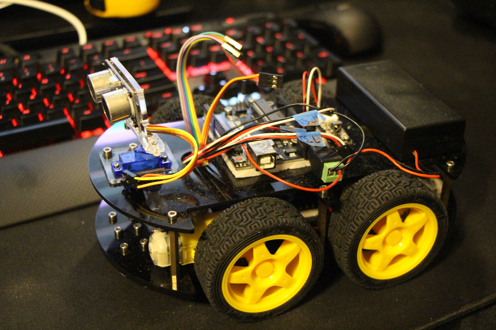

# How to Program the Arduino Boards
* 

## Hidden Files in VSCode
Some files are hidden in vscode by default, see the `files.exclude` option in the [settings file](.vscode/settings.json)

There is a [recommended extension](.vscode/extensions.json) `adrianwilczynski.toggle-hidden` that allows to easily toggle hidden files on and off

## Prerequisites
* Install [Arduino IDE](https://www.arduino.cc/en/software)
* Clone the repository with [Git](https://git-scm.com/) ot a GUI version like [GitKraken](https://www.gitkraken.com/)
* OR download a zip of the repo via the `Code` button on the upper left.

There are several scripts for the rovers:
* The [scripts](./src/scripts/) folder contains scripts that use either existing or community libraries and can be opened/run as is.
This is mostly following the original code guide from the Elegoo kit
* The [libraries](./src/libraries) are arduino libraries, see the [libraries/README.md](./src/libraries/README.md) for more info
* The [controllers](./src/controllers/) folder contains scripts that depend on the [libraries](./src/libraries)
  * See the see the [libraries/README.md](./src/libraries/README.md) for more info
  * But essentially you need to:
    * Copy the [src/libraries](./src/libraries/) to your [local arduino libraries](http://www.arduino.cc/en/Guide/Libraries)
    * You can open the library examples to test out the individual library features
    * Open the [RC_Control](./src/DDD_RC_Control/DDD_RC_Control.ino) script to control a car with an RC controller

## With [Arduino IDE](https://www.arduino.cc/en/software)
Make sure you can upload code in Arduino IDE first
* Open the IDE then click `File` -> `Open...` (Browse to the [DDD_CarAutoMotion.ino](./src/scripts/DDD_CarAutoMotion/DDD_CarAutoMotion.ino)
* Connect your arduino via USB
* `Tools` -> `Board` -> (Choose your board, this was coded for the `Arduino Uno`)
* `Tools` -> `Programmer` -> Choose `AVRISP mkII` for the Nano
* `Tools` -> `Port` -> (Chose the COM port of the arduino)
* CLick the Upload `->` Icon (Top left corner) to upload the code to the Arduino Board.

## With [VSCode](https://code.visualstudio.com/)
VSCode is more friendly to code in, so after setting up Arduino IDE you can switch over.
* Open VSCode then click `File` -> `Open Folder...` (Browse to this top level folder))
* Install the workspace recommended extensions (VSCode should ask). They are defined [here](./.vscode/extensions.json) for reference
* Connect your arduino via USB
* Change the paths in [c_cpp_properties.json](./.vscode/c_cpp_properties.json) appropriate for your system.
* If needed change values in [arduino.json](./.vscode/arduino.json). Extension will also display the Port, Programmer and Board at the bottom of the screen to switch between.
* Open [arduino-led.ino](./arduino-led.ino)
* Click the Upload Icon (Top right corner) to upload the code to the Arduino Board.

# Formatting
* See docs @ https://clang.llvm.org/docs/ClangFormatStyleOptions.html
* Ctrl + Shift + F to format
