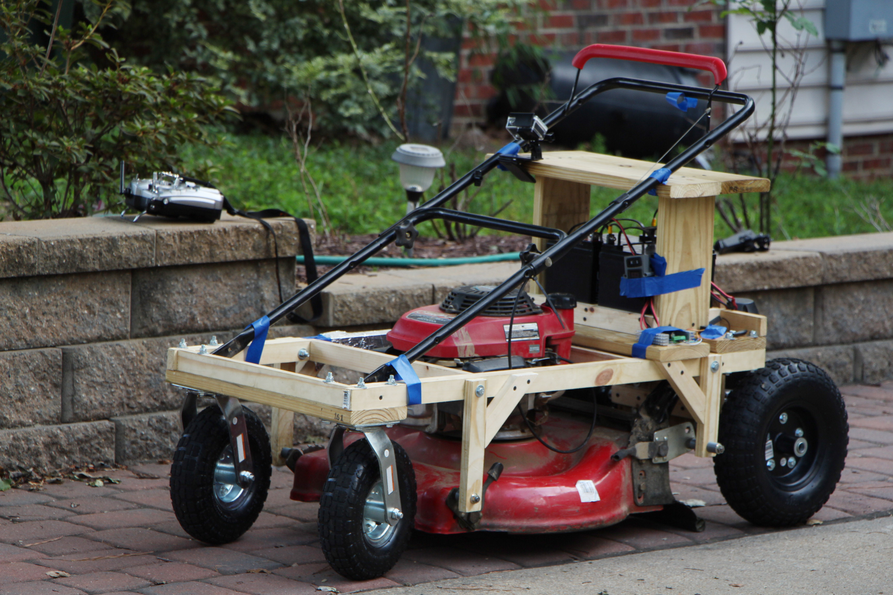

# Arduino "Rover" Controller
Arduino controllers for various land based vehicles

## Usage
For Autonomous RC Car Example

## Set up/Wire up the hardware
See [Pin Table](./PinTable.md) for wiring reference to the arduino/sensor shield

* Connect motors to the motor controller and logic cables out
  
* Connect logic from the motor controller to the arduino sensor shield
  
  

### Pinouts
* 
* 
* 

## Set up the software
See [CONTRIBUTING.md](./CONTRIBUTING.md) for more information

## RC Lawn Mower
Uses similar code
https://youtu.be/h3GMhjFH6k0

