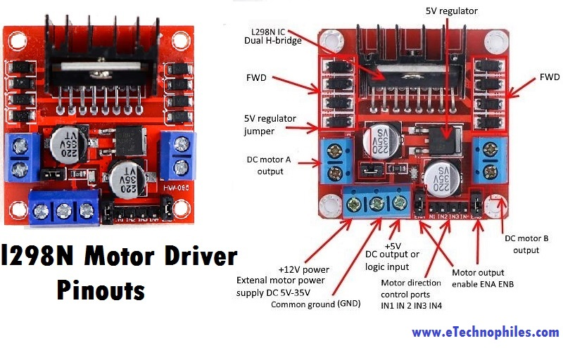

# Arduino "Rover" Controller
Arduino controllers for various land based vehicles

## Usage
For Autonomous RC Car Example

## Set up/Wire up the hardware
See [Pin Table](./PinTable.md) for wiring reference to the arduino/sensor shield

* 
* 
* 
* 
* 
* 

## Set up the software
There are several scrips for the rovers:

The [NoLibraries](./src/NoLibraries/) folder contains scripts that use either existing or community libraries and can be opened/run as is. This is mostly following the original code guide from the Elegoo kit

For the other scripts:
* Copy the [src/libraries](./src/libraries/) to your [local arduino libraries](http://www.arduino.cc/en/Guide/Libraries)
* You can open the library examples to test out the individual library features
* Open the [RC_Control](./src/DDD_RC_Control/DDD_RC_Control.ino) script to control a car with an RC controller

## RC Lawn Mower
Uses similar code
https://youtu.be/h3GMhjFH6k0

