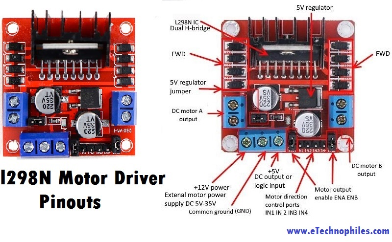

# I298n Motor Driver

## Motor controller board states
| ENA   | IN1   | IN2   | Result    |
|-------|-------|-------|-----------|
| O     | X     | X     | Stop      |
| 1     | 0     | O     | Break     |
| 1     | 0     | 1     | Forward   |
| 1     | 1     | 0     | Backward  |
| 1     | 1     | 1     | Bark      |

Pinout Diagram  

